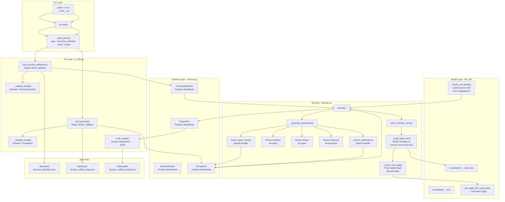

# Pipeline Flow

## Step-by-step

1. **CLI** parses 3 JSON paths (functions definition, input prompts, output)
2. **Load** function definitions & prompts from `data/input/`, validated via Pydantic schemas
3. **Init** `Small_LLM_Model` — downloads Qwen3-0.6B from HuggingFace
4. **For each prompt:**
   - **`select_function_name()`** — builds a token-ID trie of function names, walks it constrained: at each step only valid next tokens (trie children) are allowed, picks the highest logit
   - **`_generate_parameters()`** — extracts numbers/strings/booleans via regex, with special handlers for `fn_greet` and `fn_substitute_string_with_regex`
5. **Write** `OutputItem` results to `data/output/function_calling_results.json`

## Communities

- [[_COMMUNITY_CLI & Decoding Pipeline]]
- [[_COMMUNITY_Constrained Decoding Engine]]
- [[_COMMUNITY_Data Models & Schema]]
- [[_COMMUNITY_LLM Model Wrapper]]
- [[_COMMUNITY_Project Overview & Constraints]]
