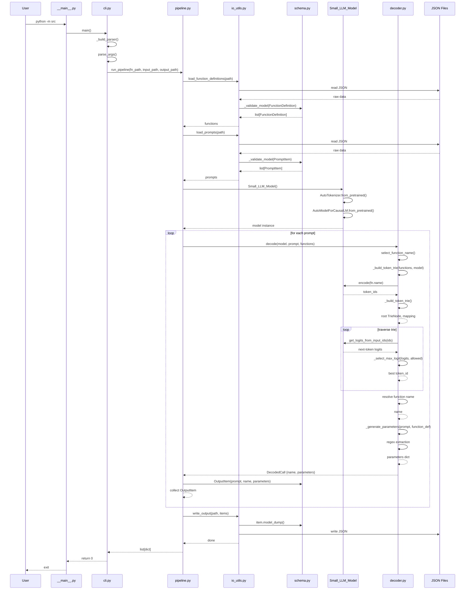

# Pipeline Sequence

## Key Design Points

| Stage | Technique | Why |
|-------|-----------|-----|
| Function selection | Trie-constrained decoding | Only valid function names are generated — LLM can't hallucinate a wrong name |
| Parameter extraction | Regex + special handlers | Deterministic, no LLM calls needed for params |
| Model | Qwen3-0.6B | Lightweight, runs on CPU/MPS/CUDA |
| Validation | Pydantic BaseModel | Runtime type safety for JSON I/O |
